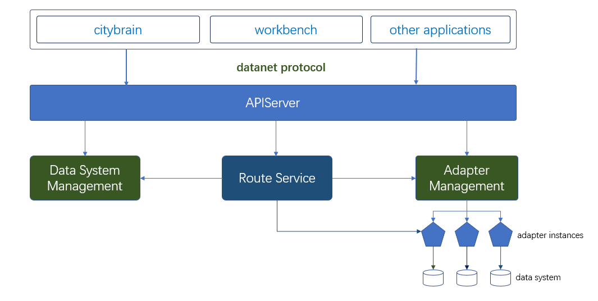
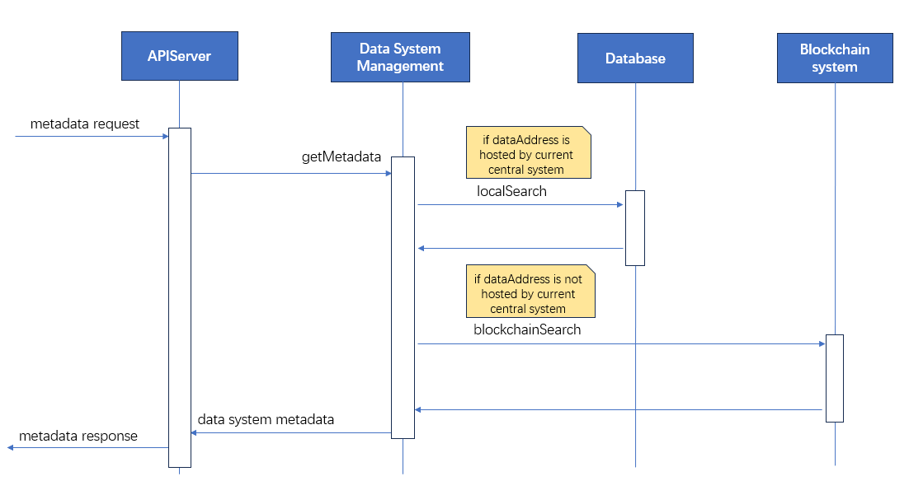
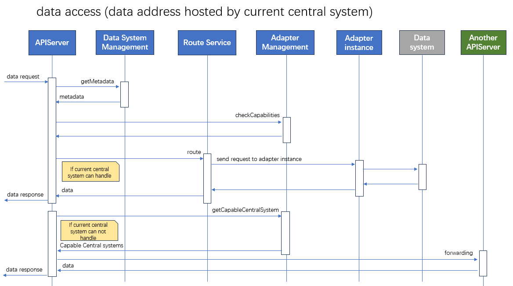
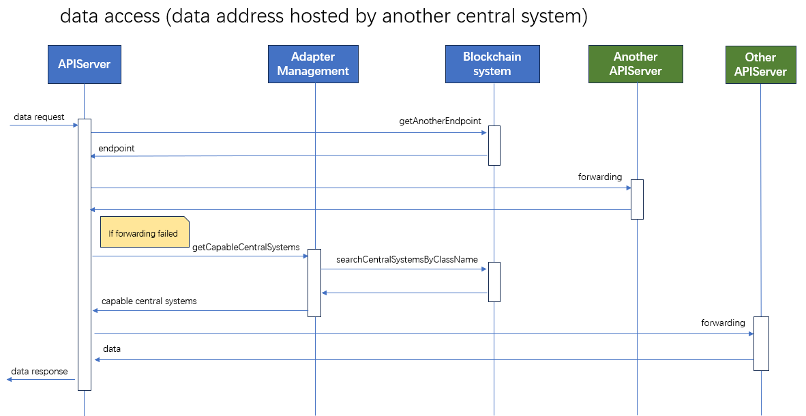
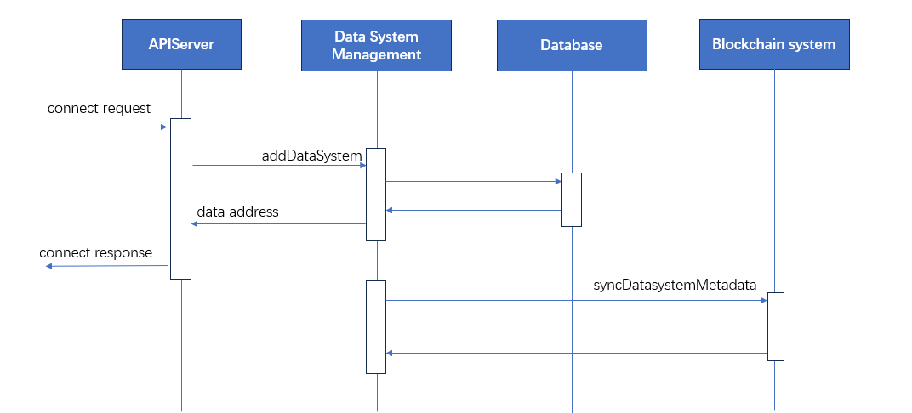
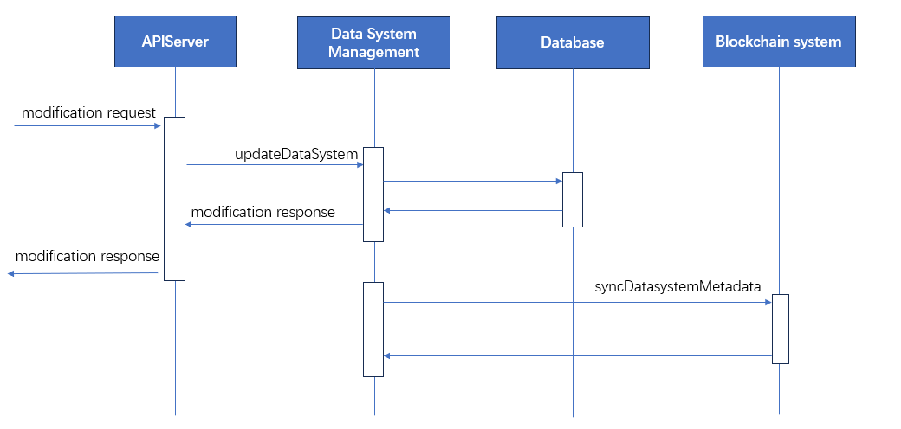
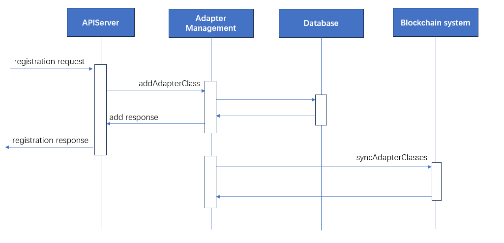
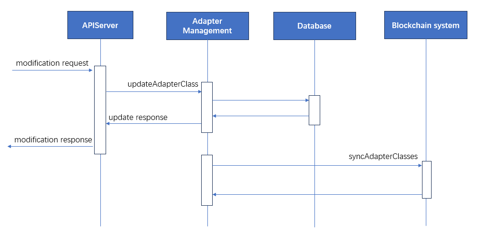

# Central System Design Draft

## 1. Overview

## 2. Core services

* **apiserver:** The entry of central system for handling all the datanet access and datanet growth requests
* **data system management:** 
  * managing the hosted data systems metadata
  * syncing all the hosted data systems metadata with blockchain system
* **adapter management:**
  * managing hosted adpater classes information
  * syncing all the hosted adapter classes information with blockchain system
  * managing hosted adapter instance running status
* **route service:** 
  * local routing client request to hosted adapter instance
* **adapter instance:** distributed running container which will receive request from route service and transform it to underling data system operation.

## 3. Interaction diagram

### 3.1 data system metadata access

### 3.2 data system data access
#### 3.2.1 data system hosted by current central system

#### 3.2.2 data system hosted by another central system

### 3.3 data system connection and modification
#### 3.3.1 data system connection

#### 3.3.2 data system modification

### 3.4 adapter class registration and modification
#### 3.4.1 adapter class registration

#### 3.4.2 adapter class modification

## 4. Infrustructure Service

* **Database:** PostgreSQL/MySQL
* **Cache Service:** Redis
* **Message Broker:** Kafka/RocketMQ