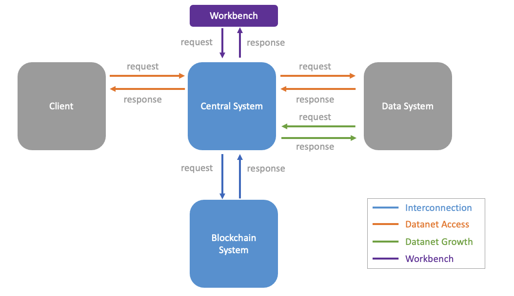

# Central System Design Documents


This is the design documents for the three systems:

* Central system
* Blockchain system
* Workbench



````

```
├── README.md
├── 1-central-system
    ├── api-doc-central-system.yaml
    ├── design-doc-central-system.md
    └── img/
├── 2-blockchaim-system
    ├── api-doc-blockchain-system.yaml
    ├── design-doc-blockchain-system.md (todo)
    └── img/
├── 3-workbench
    ├── design-doc-workbench.md
    └── img/
└── img/
```


````
