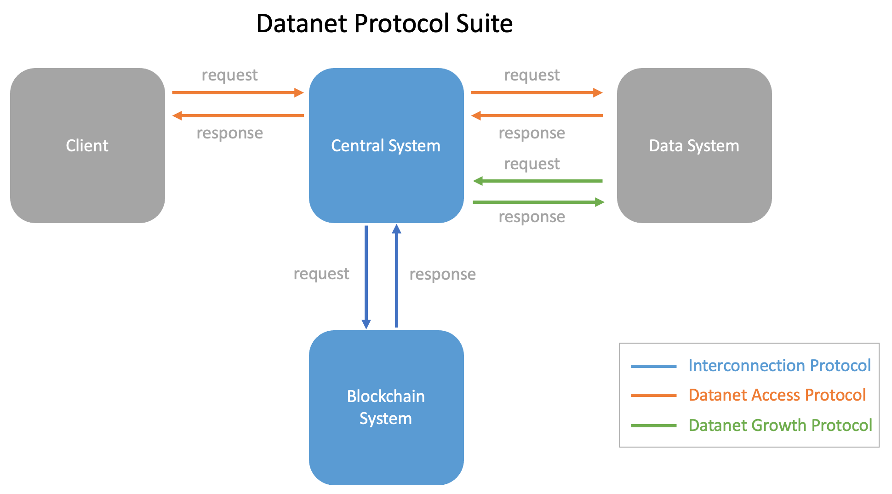

# Datanet Protocol Suite


## 1. Introduction

The Datanet Protocol Suite is designed for the communications between client and data systems. It guarantees that **any** data sysetm can be accessed from **any** interconnected central system.




The protocol suite has three protocols. **Datanet Access Protocol** is responsible for a client to fetch data from any data system through central system. 

```
request chain -------------------------->
client-----central system-----data system
<--------------------------response chain
```

**Datanet Growth Protocol** is designed for a data system to connect with the Datanet.

```
request chain --------------->
data system-----central system
<---------------response chain
```

**Interconnection Protocol** is designed for the communications between central systems through blockchain system.

```
request chain --------------------->
central system-----blockchain system
<---------------------response chain
```


## 2. Terminology

### 2.1 Data System

**Data System**

A data system provides data access and/or computation services. It may be a web service, a database system, a file system, or an object storage.

**Data Address**

A unique identifier on the Datanet for a data system. This address is allocated by central system with decentralized consensus mechanism. 

**Data System Protocol**

(standard protocol) The protocol and its corresponding version that data system uses for connection. For example, MySQL 8.0, ODPS 3.16, HTTP 2.0, and Modbus TCP.

(user-defined protocol) The protocol could also include some user-defined parameters. For example, some data system may require a signature for access. 

**Data System Metadata** (required)

1. Data address: a unique address on the Datanet
2. Name: the name of a data system, it does not need to be unique
3. Adapter class: the adapter class that match with data system protocol 
4. Endpoint: the address to access this data system. An endpoint usually contains an IP address and a port number, separated by character ":".


### 2.2 Central System

**Central System**

Central system is responsible for communication between client and data system by using the corresponding adapter instance. It is also used to assign a unique data address to a data system.  

**Data System Connection**

A data system can be connected to a central system. Once connected, this central system is called as the **host of this data system**. One can also find the host of the data system by looking up the central system ID in data address (i.e., the first part of the data address before the separation charater "."). 

A data system can be connected to multiple central systems and thus it could have multiple hosts.

**Central System Metadata** (required)

1. Central system ID. ID is chosen by the central system itself. It must be unique across all the central systems on the Datanet. This uniqueness is maintained by the blockchain system. If the chosen ID was used by another central system prior to this central system's connection, a new ID must be provided by this central system.
2. Central system endpoint. The address to access this central system. Central system endpoint is the link to the API server of the central system.
4. Adapater capabilities. Adapater capabilities is a list of adapter classes that this central system has the corresponding adapters running instances.


### 2.3 Adapter Class and Adapter Instance

**Adapter Class**

An adapter class is a specification that an adapter instance must follow. 

Adapter class must include class name and protocol information (including protocol name and protocol version). Adapater class name must be unique on Datanet. 

**Adapter Class Metadata** (required)

1. Adapter class name.
2. Protocol.

**Adapter Instance**

An adapter instance transforms the request message of a client to the message that follows the data system protocol. 

**Adapter Instance Metadata** (required)

1. Adapter class. 
2. Endpoint.

**Central System Capabilities**

A central system could have multiple adapter classes. 

The central system should install the corresponding adapter instances if this central system claims to have a certain adapter class. 

The adapter classes that a central system have are called the capabilities of this central system.


### 2.4 Blockchain System

Blockchain system is used to maintain the data with the global consensus across all central systems. Such data include metadata of all data systems, metadata of all central systems, and all adapter classes. All the metadata are required metadata only. 

Each central system MUST share all such data with blockchain system.  The data on blockchain is shared across all the central systems. 


### 2.5 Datanet and Data Network

**Data Network** The data systems connected with a central system form a data network. Note a data system could connect to multiple central systems, and hence it could belong to different data networks.

**Datanet** The union of all the data networks form the Datanet.

The concepts of data network and datanet are similar to the concepts of computer network LAN and WAN respectively.


## 3. Data Address Naming Rule

Data address is formed by concatenating central system ID and data system ID, separated by a dot (i.e., ".") character. 

Central system ID and data system ID are both in STRING data type with only digits and letters, characters are not allowed. The length of central system ID is no more than 32 characters. The length of data system ID is no more than 16 charaters. The choice of 16 is adopted from 64-bit HEX representation by Twitter's Snowflake service.

For example, a data address could be Yunqi.15A5C76E1E021000, where Yunqi is the central system ID, 15A5C76E1E021000 is a data system ID.


## 4. Authentication

**Growth Token** (required)

A data system should get an access token in order to get connected with a central system. This token is generated and maintained by central system admin. Central system admin will decide how to share the token with the data system contributor.

**Access Token** (optional)

A client may need to get an access token first in order send a request to the central system. If the central system is open to public for anyone to access, a client does not need a token for access. Central system admin will decide how to share the token with the client.

**Interconnection Token** (required)

An interconnection token is needed when a central system forwards request to another central system. The token is generated by the central system for another central system to connect with it. Central system admin will decide how to share the token with another central system admin.

**Blockchain Token** (required)

The blockchain token is needed when a central system sends request to the blockchain system. The token is generated by the blockchain system for a central system to connect with it. Blockchain system admin will decide how to share the token with central system admin. 


## 5. Response Code

**Shared Response Code across Protocols**

* **200** OK
* **7000** central system internal error
* **7001** data address not found
* **7002** access to central system denied


**Datanet Growth Protocol Response Code**

* **7100** missing required parameters
* **7101** adapter class not found
* **7102** data address does not belong to you


**Datanet Access Protocol Response Code**

* **7201** data system endpoint error

* **7202** data system does not respond

* **7203** data system rejects the request

  

**Interconnection Protocol Response Code**

* **7300** bad request
* **7310** invalid central system ID
* **7311** invalid adapter class definition
* **7312** invalid data system metadata
* **7313** invalid required search parameter
* **7314** blockchain system internal error

