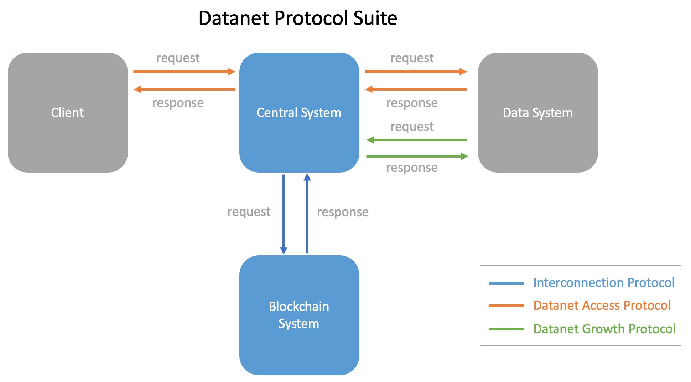

# Datanet Protocol Suite

* 0-Datanet-Protocol.md: Datanet protocol suite overview. 
* 1-Interconnection.md: Interconnection protocol.
* 2-Datanet-Growth.md: Datanet growth protocol.
* 3-Datanet-Access.md: Datanet access protocol.

