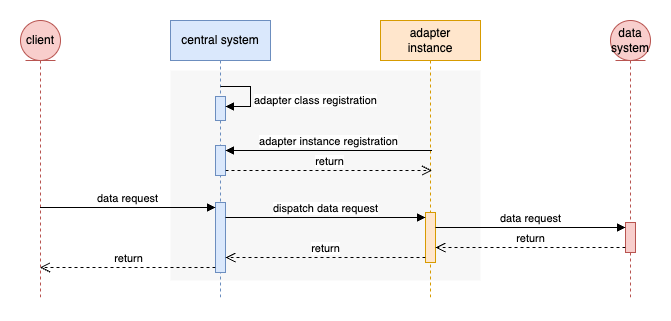

# Adapter Development Specification

The adapter is the bridge between the zhongshu and the data system. In a data request, the adapter is used to establish a connection to the data system and to transform the parameters of the request from the client.

## 1. Sequence Diagram



## 2. Terminology

### Adapter Class

A protocol parameter definition that defines the protocols and request parameters supported by a class of adapters.


### Adapter Instance

When an Adapter Class implementation is deployed and running, it becomes an Adapter Instance. A class can be associated with multiple instances.

## 3. Adapter Class Registration

### 3.1. Request from adapter class to central system

#### 3.1.1. Parameters

- **name:** the name of the adapter class (string, required)
- **capabilities:** protocols that the adapter class capable for (array, required)
- **desc:** the description of the adapter class (string, optional)
- **authors:** the authors of the adapter class (array, optional)
- **paramsDef:** the parameters definition of the adapter class (array, optional)

#### 3.1.2. Schema

```json
{
    "$id": "/api/v1/adapter/class/registration",
    "type": "object",
    "properties": {
        "header": {
            "type": "object",
            "properties": {
                "version": {
                    "const": "adapter 1.0"
                }
            },
            "required": ["version"]
        },
        "spec": {
            "type": "object",
            "properties": {
                "name": {"type": "string"},
                "capabilities": {
                    "type": "array",
                    "items": {
                        "type": "object",
                        "properties": {
                            "protocol": {"type": "string"},
                            "version": {"type": "string"}
                        },
                        "required": ["protocol", "version"]
                    }
                },
                "desc": {"type": "string"},
                "authors": {
                    "type": "array",
                    "items": {
                        "type": "object",
                        "properties": {
                            "name": {"type": "string"},
                            "email": {"type": "string"}
                        },
                        "required": ["name", "email"]
                    }
                },
                "paramsDef": {
                    "type": "array",
                    "items": {
                        "type": "object",
                        "properties": {
                            "name": {"type": "string"},
                            "type": {"type": "string"}
                        },
                        "required": ["name", "type"]
                    }
                }
            },
            "required": ["name", "capabilities"]
        }
    }
}
```

### 3.2. Reponse from central system to adapter class

#### 3.2.1. Parameters

- **class_id:** the id of the adapter class (string, required)

#### 3.2.2. Schema

```json
{
    "type": "object",
    "properties": {
        "header": {
            "type": "object",
            "properties": {
                "version": {
                    "const": "adapter 1.0"
                }
            },
            "required": ["version"]
        },
        "body": {
            "type": "object",
            "properties": {
                "class_id": {"type": "string"}
            },
            "required": ["class_id"]
        }
    },
    "required": ["header", "body"]
}
```

## 4 Adapter Instance Registration

Central system provides interface for adapter instances to register when they are launched. The adapter instance needs to provide the id of the adapter class it implements and the connection endpoint of the current instance.

### 4.1. Request from adapter instance to central system

#### 4.1.1. Parameters

- **class_id:** class id of the adapter instance (string, required)
- **instance_endpoint:** the network address of the instance (string, required)
- **data_transport_protocol:** the transport protocol between the adapter instance and the central system (string, required)
- **authors:** authors of the adapter instance (array, optional)

#### 4.1.2. Schema

```json
{
    "$id": "/api/v1/adapter/instance/registration",
    "type": "object",
    "properties": {
        "header": {
            "type": "object",
            "properties": {
                "version": {
                    "const": "adapter 1.0"
                }
            },
            "required": ["version"]
        },
        "spec": {
            "type": "object",
            "properties": {
                "class_id": {"type": "string"},
                "instance_endpoint": {"type": "string"},
                "data_transport_protocol": {"type": "string"},
                "authors": {
                    "type": "array",
                    "items": {
                        "type": "object",
                        "properties": {
                            "name": {"type": "string"},
                            "email": {"type": "string"}
                        },
                        "required": ["name", "email"]
                    }
                }
            },
            "required": ["class", "instance_endpoint", "data_transport_protocol"]
        }
    }
}
```